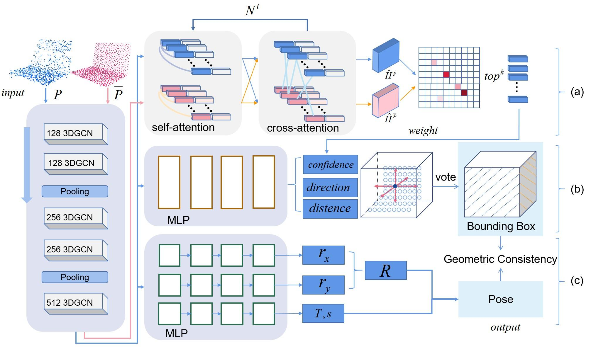

# GSV-Pose
PyTorch implementation of the paper: Pose Estimation Method Based on Geometric Similarity Voting



<!-- ## UPDATE!
The results on NOCS and the trained model on CAMERA can be found [here](https://drive.google.com/drive/folders/1hSaE1xYdBDJmMkVTt1i9JkrUgl_nNZO1?usp=sharing). -->


## Required environment

- Ubuntu 18.04
- Python 3.8 
- Pytorch 1.10.1
- CUDA 11.3.

## Installing

- Install the main requirements in 'requirement.txt'.
- Install [Detectron2](https://github.com/facebookresearch/detectron2).
- Install packages and other dependencies in 'setup.py'

## Data Preparation
- To generate your own dataset, use the data preprocess code provided in this [git](https://github.com/mentian/object-deformnet/blob/master/preprocess/pose_data.py).
- Download the detection results in this [git](https://github.com/Gorilla-Lab-SCUT/DualPoseNet).
- Download GeoTransformer's pre-trained weights in this [link](https://github.com/qinzheng93/GeoTransformer/releases)


## model
Download the trained model from this [link](https://drive.google.com/drive/folders/1GrCYZIJPPrtozOUS8MHI0Y1dbxn6Kl2-?usp=sharing).

## Training
Please note, some details are changed from the original paper for more efficient training. 

Specify the dataset directory and run the following command.
```shell
python -m engine.train --data_dir YOUR_DATA_DIR --model_save SAVE_DIR
```

Detailed configurations are in 'config/config.py'.

## Evaluation
```shell
python -m evaluation.evaluate --data_dir YOUR_DATA_DIR --detection_dir DETECTION_DIR --resume 1 --resume_model MODEL_PATH --model_save SAVE_DIR
```

## Acknowledgment
Our implementation leverages the code from [GeoTransformer](https://github.com/qinzheng93/GeoTransformer), [GPV-Pose](https://github.com/lolrudy/GPV_Pose) [3dgcn](https://github.com/j1a0m0e4sNTU/3dgcn), [FS-Net](https://github.com/DC1991/FS_Net),
