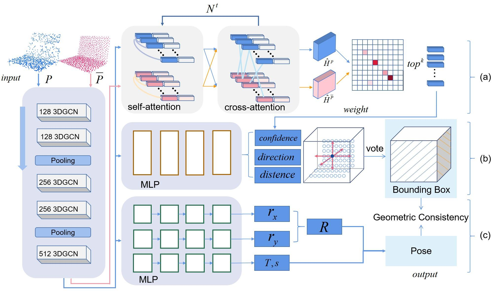

# GSV-Pose
PyTorch implementation of the paper: Pose Estimation Method Based on Geometric Similarity Voting




## Required environment

- Ubuntu 20.04
- Python 3.8 
- Pytorch 1.10.1
- CUDA 11.3

## Installing

- 使用conda创建虚拟环境
`conda create -n gsvpose python=3.10`, Install the main requirements in 'requirement.txt'.
- Install [Detectron2](https://github.com/facebookresearch/detectron2).
- Install [GeoTransformer](https://github.com/qinzheng93/GeoTransformer.git), download the source code and unzip it to the same directory and run the following command:
```bash
# pip install -e GeoTransformer-1.0.0
cd network && pip install -e .
```

## Data Preparation
- Download the data provided by [NOCS](https://github.com/hughw19/NOCS_CVPR2019) ([real_train](http://download.cs.stanford.edu/orion/nocs/real_train.zip), [real_test](http://download.cs.stanford.edu/orion/nocs/real_test.zip),
[ground truths](http://download.cs.stanford.edu/orion/nocs/gts.zip) and structurelized as [DualPoseNet](https://github.com/Gorilla-Lab-SCUT/DualPoseNet) like: 
```
data
├── CAMERA
│   ├── train
│   └── val
├── real
│   ├── train
│   └── test
├── gts
│   ├── val
│   └── real_test
└── obj_models
    ├── train
    ├── val
    ├── real_train
    └── real_test
```
Download the pre-trained models, segmentation results from Mask R-CNN, and predictions of NOCS from [here](https://drive.google.com/file/d/1p72NdY4Bie_sra9U8zoUNI4fTrQZdbnc/view?usp=sharing), Then run python scripts to prepare the datasets.

```bash
unzip deformnet_eval.zip
mv deformnet_eval results

python preprocess/shape_data.py
python preprocess/pose_data.py
```
其中有垃圾数据需要去掉
`data/obj_models/val/02876657/d3b53f56b4a7b3b3c9f016d57db96408`


```bash

```

Download GeoTransformer's pre-trained weights in this [link](https://github.com/qinzheng93/GeoTransformer/releases)

将GPV-Pose下载的mug_handle.pkl移动到`data/Real/train`目录下.

## model
Download the trained model from this [link](https://drive.google.com/drive/folders/1GrCYZIJPPrtozOUS8MHI0Y1dbxn6Kl2-?usp=sharing).

## Training
Please note, some details are changed from the original paper for more efficient training. 

Specify the dataset directory and run the following command.
```shell
python -m engine.train --dataset_dir YOUR_DATA_DIR --dataset YOUR_DATASET --model_save SAVE_DIR
```

Detailed configurations are in 'config/config.py'.

## Evaluation
```shell
python -m evaluation.evaluate --data_dir YOUR_DATA_DIR --resume 1 --resume_model MODEL_PATH --model_save SAVE_DIR
```

## Acknowledgment
Our implementation leverages the code from [GeoTransformer](https://github.com/qinzheng93/GeoTransformer), [GPV-Pose](https://github.com/lolrudy/GPV_Pose) [3dgcn](https://github.com/j1a0m0e4sNTU/3dgcn), [FS-Net](https://github.com/DC1991/FS_Net),
